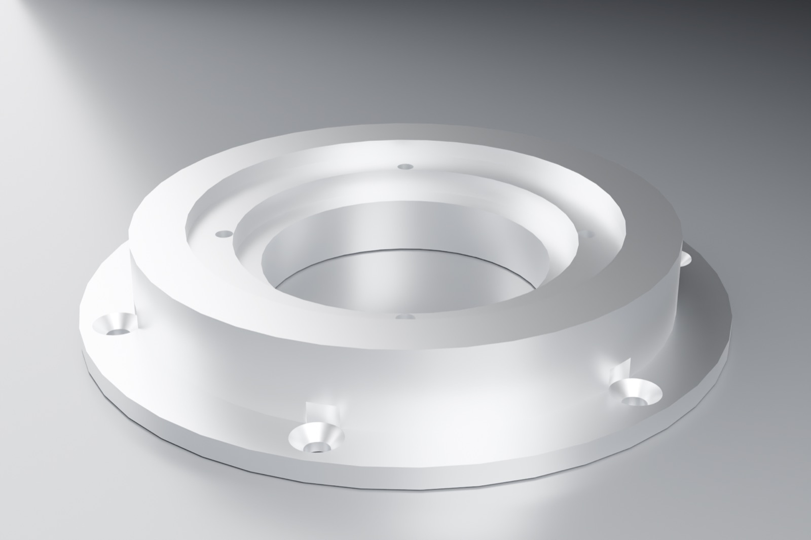
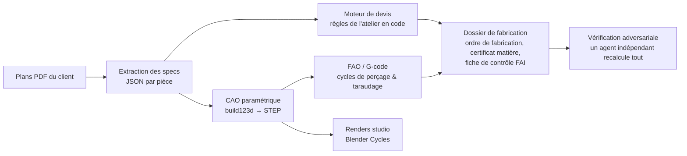

[English](README.md) · **Français**

# De la RFQ au G-code en une soirée — une chaîne agentique CAO/FAO pour l'usinage de précision

*Un retour de terrain. Une soirée, un modèle orchestrateur, 42 agents IA spécialisés, et une vraie demande de prix (RFQ) de 7 pièces d'un atelier d'usinage de précision français — traitée depuis les plans PDF jusqu'à un devis chiffré, des modèles 3D validés, un programme de perçage CN et un dossier de fabrication complet. La pièce de démonstration ci-dessous montre la qualité de sortie de la chaîne.*


*DEMO-FLANGE-001 — modélisée en CAO paramétrique exacte par un agent IA, exportée en STEP, rendue avec Blender Cycles par la même chaîne.*

---

## Le problème

Un petit atelier d'usinage de précision (10-15 personnes, travail de niveau aéronautique/énergie) vit et meurt par ses devis. Les chiffres du dirigeant lui-même :

- **4 heures** pour chiffrer une pièce à la main (lire le plan, déterminer le brut, estimer le temps d'usinage, chiffrer la matière, rédiger),
- **~7 jours** pour répondre à une RFQ multi-pièces,
- **2 devis sur 3 perdus**, en partie face à des concurrents plus rapides,
- des RFQ déclinées faute de temps — du chiffre d'affaires qui n'a jamais l'occasion d'exister.

Le goulot d'étranglement n'est pas dans les machines. Il est dans le chemin entre *un PDF client* et *une réponse signée et défendable*.

## Ce que fait la chaîne

En un seul passage autonome, sur une RFQ réelle de 7 pièces :



1. **Lecture des plans** — un agent par PDF lit le cartouche et la géométrie : matière, traitements, tolérances générales, chaque perçage, taraudage, ajustement et état de surface, et propose un brut avec surépaisseurs d'usinage.
2. **Chiffrage** — un moteur transparent chiffre chaque ligne : masse du brut × prix matière du jour (LME + cotations distributeurs, sourcées et datées), estimations de temps par opération, les taux horaires et règles propres de l'atelier encodés en *Python lisible*. Chaque euro montre sa formule.
3. **CAO** — les agents ne génèrent pas de mesh. Ils écrivent du code [build123d](https://github.com/gumyr/build123d) (noyau OpenCascade) et le résultat est une géométrie **exacte, paramétrique, exportable en STEP** qui s'ouvre dans SolidWorks. Chaque modèle est ensuite *validé par mesure* : boîte englobante comparée au plan, chaque diamètre nominal présent dans le B-rep, masse calculée comparée au cartouche.
4. **FAO** — G-code de cycles de perçage/taraudage aux positions vérifiées trigonométriquement, plus une stratégie d'entrée matière documentée (hélicoïdale vs rampe vs plongée) que l'opérateur machine — pas l'IA — valide.
5. **Dossier de fabrication** — ordre de fabrication, bon de débit matière avec exigence de certificat EN 10204 3.1, fiche de contrôle premier article type AS9102 avec les bornes ISO 286 calculées et contre-vérifiées (ex. Ø140 H7 → +0,040/0), notes de traçabilité.
6. **Vérification adversariale** — un agent séparé dont le seul rôle est de *casser* le travail des autres : il redérive chaque total, recalcule chaque tolérance, vérifie le G-code numériquement.

**Chiffres de la session** : 42 agents orchestrés sur deux passes · ~1 h 55 de calcul autonome · 3,06 M de tokens agents (≈ 30 $ d'équivalent API) · 7 pièces chiffrées, 7 pièces modélisées, 70+ fichiers livrés. Temps humain *pendant* l'exécution : zéro. Temps humain *après* : une relecture — ce qui est exactement le but.

## Les trois choses qui ont fait que ça marche vraiment

### 1. De la CAO exacte, pas de l'« IA 3D »

Les démos texte-vers-3D produisent généralement des meshes : bien pour un render, inutile pour un atelier d'usinage. Ici le LLM écrit du code CAO paramétrique contre un noyau B-rep exact, et la boucle est fermée par une **mesure déterministe**, pas par des impressions :

```python
# l'agent écrit du code comme celui-ci (fichier complet dans demo/)
with BuildPart() as p:
    Cylinder(D_OUT / 2, H_FLANGE, align=(Align.CENTER, Align.CENTER, Align.MIN))
    Cylinder(D_BODY / 2, H_TOTAL, align=(Align.CENTER, Align.CENTER, Align.MIN))
    Cylinder(D_BORE / 2, H_TOTAL, mode=Mode.SUBTRACT)          # Ø80 H7 bore
    ...
# puis la chaîne mesure le résultat : boîte englobante, chaque Ø, volume → masse,
# et compare au plan avant que la pièce soit acceptée.
```

Sur le dossier réel, la pièce phare est revenue avec sa boîte englobante exacte au plan et les dix diamètres nominaux présents dans le solide.

### 2. L'honnêteté comme feature architecturale

Les plans scannés sont ambigus. Règle de la chaîne : **une cote illisible ne devient jamais une supposition — elle devient une question.** Chaque modèle est livré avec un `assumptions.md` : « ces profondeurs de lamage ne sont pas cotées sur le plan, voici ce que j'ai lu graphiquement, le bureau d'études doit confirmer. » Sur la RFQ réelle, cela a même permis de détecter une **incohérence de chaîne de cotes à l'intérieur du plan du client lui-même** (deux chaînes impliquant des hauteurs totales différentes) — signalée au bureau d'études plutôt que moyennée en silence.

C'est la partie que la plupart des démos évitent, et c'est exactement ce qui rend le résultat utilisable dans un atelier réel : l'expert humain est positionné comme l'autorité qui tranche les questions, pas comme un spectateur.

### 3. La vérification adversariale (le bug qui a justifié toute l'architecture)

L'agent de vérification indépendant a trouvé un bug réel et dangereux avant qu'aucun humain ne voie les fichiers : l'en-tête du G-code déclarait l'origine Z en **haut** du brut alors que les coordonnées avaient été calculées depuis la face **inférieure** — un décalage de 35 mm qui aurait envoyé l'outil dans un endroit très désagréable. Détecté par recalcul, corrigé, re-vérifié.

Cette seule prise est le meilleur argument pour l'architecture : les générateurs génèrent, un sceptique séparé recalcule, et l'opérateur garde le dernier mot à la machine. La confiance se construit par du contrôle *visible*, pas par de l'assurance affichée.

## Ce qui reste humain — par conception

- L'**opérateur** valide le bridage, la stratégie d'entrée matière et les avances à la machine.
- Le **bureau d'études** tranche chaque hypothèse signalée avant que quoi que ce soit ne soit usiné.
- Le **chiffreur** relit un calcul transparent au lieu de le construire à partir de zéro (4 h → une relecture).
- Rien ne part chez un client sans signature humaine. Le système comprime le temps ; il ne remplace pas le jugement.

## Essayer la démo

Tout ce qui se trouve dans [`demo/`](demo/) est autonome :

| Fichier | Ce que c'est |
|---|---|
| `demo_flange.py` | Le générateur build123d qu'un agent écrirait |
| `demo_flange.step` / `.stl` | Géométrie exacte — ouvrir le STEP dans SolidWorks/FreeCAD |
| `demo_drilling.nc` | Cycles génériques de perçage/taraudage ISO avec vitesses et avances calculées (illustratif, pas prêt-machine) |
| `demo_flange_render.jpg` | Le render Blender Cycles ci-dessus |
| `demo-quote.md` | Un devis dans le style transparent du moteur, avec **taux d'exemple** |

Stack : [Claude](https://claude.com) (un orchestrateur + sous-agents spécialisés) · [text-to-cad skills](https://github.com/earthtojake/text-to-cad) · [build123d](https://github.com/gumyr/build123d)/OpenCascade · FreeCAD headless · Blender Cycles · `<model-viewer>` pour la revue STEP/GLB dans le navigateur.

## Qui a fait ça

Je suis **Ismaël Joffroy Chandoutis** — je conçois et déploie des chaînes IA agentiques : orchestration multi-agents avec boucles de vérification, pour des PME industrielles (chiffrage, CAO/FAO, documents de production) et pour les industries créatives. Ce projet entier — recherche, chaîne, vérification, documentation — a été orchestré en une seule session, une soirée, par une personne et un environnement IA.

Si votre entreprise chiffre des pièces usinées, lit des plans techniques, ou se noie dans n'importe quelle chaîne PDF-vers-document, cette approche se transpose directement.

**Contact :** contact@ismaeljoffroychandoutis.com

---

*Les fichiers de démo sont sous licence MIT — utilisez-les comme vous voulez, mais ne faites pas tourner `demo_drilling.nc` sur une vraie machine sans revue professionnelle.*
