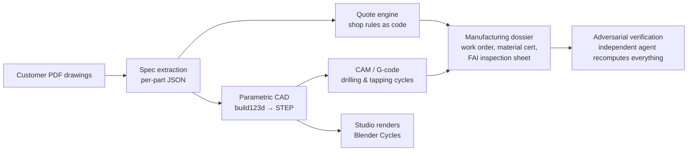

# From RFQ to G-code in one evening — an agentic CAD/CAM pipeline for precision machining

*A field report. One evening, one orchestrator model, 42 specialized AI agents, and a real 7-part request-for-quote from a French precision machining shop — taken from PDF drawings all the way to a priced quote, validated 3D models, a CNC drilling program and a complete manufacturing dossier. With the confidential parts removed and a fully synthetic demo part included so you can see the pipeline's output quality for yourself.*


*DEMO-FLANGE-001 — a synthetic part created for this article. Modeled as exact parametric CAD by an AI agent, exported to STEP, rendered with Blender Cycles by the same pipeline. Every dimension invented; no customer data anywhere in this repository.*

---

## The problem

A small precision machining shop (10-15 people, aerospace/energy-grade work) lives and dies by its quotes. At the shop in question, the owner's own numbers:

- **4 hours** to quote one part manually (read the drawing, work out the blank, estimate the machining time, price the material, write it up),
- **~7 days** to answer a multi-part RFQ,
- **2 out of 3 quotes lost**, partly to faster competitors,
- RFQs declined for lack of time — revenue that never gets a chance to exist.

The bottleneck is not the machines. It is the path between *a customer PDF* and *a signed, defensible answer*.

## What the pipeline does

In one autonomous run, on a real 7-part RFQ (under NDA — every number and drawing in this repo is synthetic):



1. **Drawing intake** — one agent per PDF reads the title block and geometry: material, treatments, general tolerances, every hole, thread, fit and surface finish, and proposes a stock blank with machining allowances.
2. **Quoting** — a transparent engine prices each line: blank mass × live material prices (LME + distributor quotes, scraped with sources and dates), operation-level time estimates, the shop's own hourly rates and rules encoded as *readable Python*. Every euro shows its formula.
3. **CAD** — the agents don't generate meshes. They write [build123d](https://github.com/gumyr/build123d) code (OpenCascade kernel) and the result is **exact, parametric, STEP-exportable geometry** that opens in SolidWorks. Each model is then *validated by measurement*: bounding box against the drawing, every nominal diameter present in the B-rep, computed mass against the title block.
4. **CAM** — drilling/tapping cycle G-code with trigonometrically verified hole positions, plus a documented material-entry strategy (helical vs ramp vs plunge) that the machine operator — not the AI — signs off.
5. **Manufacturing dossier** — work order, material cut sheet with EN 10204 3.1 cert requirements, an AS9102-style first-article inspection sheet with ISO 286 limits computed and double-checked (think Ø140 H7 → +0.040/0), traceability notes.
6. **Adversarial verification** — a separate agent whose only job is to *break* the others' work: it re-derives every total, re-computes every tolerance, checks the G-code numerically.

**Session numbers** (real, anonymized): 42 agents orchestrated across two passes · ~1 h 55 of autonomous compute · 3.06 M agent tokens (≈ $30 of API-equivalent) · 7 parts quoted, 7 parts modeled, 70+ files delivered. Human time *during* execution: zero. Human time *after*: a review pass — which is the whole point.

## The three things that made it actually work

### 1. Exact CAD, not "AI 3D"

Text-to-3D demos usually produce meshes: fine for a render, useless for a machine shop. Here the LLM writes parametric CAD code against an exact B-rep kernel, and the loop is closed with **deterministic measurement**, not vibes:

```python
# the agent writes code like this (full file in demo/)
with BuildPart() as p:
    Cylinder(D_OUT / 2, H_FLANGE, align=(Align.CENTER, Align.CENTER, Align.MIN))
    Cylinder(D_BODY / 2, H_TOTAL, align=(Align.CENTER, Align.CENTER, Align.MIN))
    Cylinder(D_BORE / 2, H_TOTAL, mode=Mode.SUBTRACT)          # Ø80 H7 bore
    ...
# then the pipeline measures the result: bounding box, every Ø, volume → mass,
# and compares against the drawing before the part is accepted.
```

On the real job, the flagship part came back with its bounding box exact to the drawing and all ten nominal diameters present in the solid.

### 2. Honesty as an architectural feature

Scanned drawings are ambiguous. The pipeline's rule: **an unreadable dimension never becomes a guess — it becomes a question.** Every model ships with an `assumptions.md`: "these recess depths are not dimensioned on the drawing, here is what I read graphically, engineering must confirm." On the real RFQ this even caught a **dimension-chain inconsistency inside the customer's own drawing** (two chains implying different overall heights) — flagged to the design office instead of silently averaged.

This is the part most demos skip, and it is exactly what makes the output usable in a real shop: the human expert is positioned as the authority who settles questions, not as a spectator.

### 3. Adversarial verification (the bug that justified everything)

The independent verification agent found a real, dangerous bug before any human saw the files: the G-code header declared the Z datum on the **top** of the stock while the coordinates had been computed from the **bottom** face — a 35 mm offset that would have sent the tool somewhere very unpleasant. Caught by recomputation, fixed, re-verified.

That single catch is the best argument for the architecture: generators generate, a separate skeptic recomputes, and the operator still has the final word at the machine. Trust is built from *visible* checking, not from confidence.

## What stays human — by design

- The **operator** validates workholding, the entry-into-material strategy and feeds at the machine.
- The **design office** settles every flagged assumption before anything is cut.
- The **quoter** re-reads a transparent calculation instead of building it from scratch (4 h → a review).
- Nothing leaves for a customer without a human signature. The system compresses time; it does not replace judgment.

## Try the demo

Everything in [`demo/`](demo/) is synthetic and self-contained:

| File | What it is |
|---|---|
| `demo_flange.py` | The build123d generator an agent would write |
| `demo_flange.step` / `.stl` | Exact geometry — open the STEP in SolidWorks/FreeCAD |
| `demo_drilling.nc` | Generic ISO drilling/tapping cycles with computed speeds & feeds (illustrative, not machine-ready) |
| `demo_flange_render.jpg` | The Blender Cycles render above |
| `demo-quote.md` | A quote in the engine's transparent style, with **example rates** |

Stack: [Claude](https://claude.com) (one orchestrator + specialized sub-agents) · [text-to-cad skills](https://github.com/earthtojake/text-to-cad) · [build123d](https://github.com/gumyr/build123d)/OpenCascade · FreeCAD headless · Blender Cycles · `<model-viewer>` for in-browser STEP/GLB review.

## Confidentiality

The real engagement is under NDA. Nothing in this repository identifies the shop, its customers, its parts, its prices or its business rules: the demo part, the rates in `demo-quote.md` and every number in the example files were invented for publication. The session statistics (agent counts, durations, token counts) are the only real artifacts, because they reveal nothing about anyone.

## Who did this

I'm **Ismaël Joffroy Chandoutis** — I design and deploy agentic AI pipelines: multi-agent orchestration with verification loops, for industrial SMEs (quoting, CAD/CAM, production documents) and creative industries. This entire project — research, pipeline, verification, documentation — was orchestrated in a single evening session, by one person and one AI environment.

If your company quotes machined parts, reads technical drawings, or drowns in any PDF-to-document pipeline, this approach transfers directly.

**Contact:** contact@ismaeljoffroychandoutis.com

---

*All trademarks belong to their owners. The demo files are MIT-licensed; use them however you like, but do not run `demo_drilling.nc` on a real machine without a professional review.*
